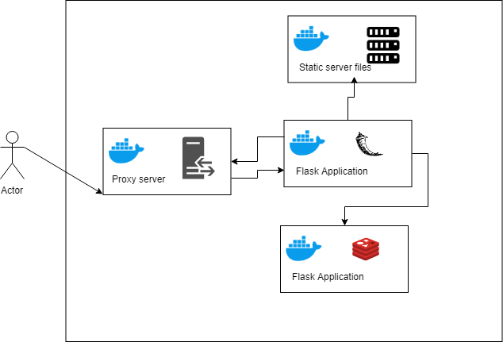

# Exercise 3

# Description

Writing your first docker compose file
○ Before a deep dive into orchestration tools, we are going to start
here with the basics, you will need to do the following.
■ Create a dockerfile that will have python installed in it
(from python base image), and install the flask framework.
■ Create an redis image (from redis base image) that will
serve as the database for the python app.

■ Create an nginx dockerfile (from nginx base image) that will
be useful to serve all your static files.
■ Create an nginx dockerfile (from nginx base image) that
will work as your proxy server.

With all of this setup, what you need to do is the following.
The application logic, can be whatever you like, make it simple :)
These are few requirements.

● The python app will need to talk with the redis database.
● The static content needs to be served from the nginx
container.
● There should be a nginx container different from the above
one, that will act as a proxy for the python and the
nginx/static container.
●

All of this configuration, needs to be automated with docker-compose
files.


## Flask
The application is a CRUD developed with python by flask 
It is connected to the Redis database through port 6379 via tcp 


### Index page
```
http://flask/ 
```


### Post method
```
http://flask/handle_data
```
### Parameters

dpi - Id of the person
name - Name of the person


## Static file server
Provaides static files for example js files for boostrap, and css 


## Proxy Server
Reroute traffic to the Flask container and also to the static file server in the port 8080 

## Redis
Redis (Remote Dictionary Server) is a Database with a Key-Value storage engine. In addition, the data resides mainly in memory, which gives this system very good response times in information retrieval.


## Docker-compose 

Proxy server is running in port 8080 

```
  proxy:
    build: Proxy
    ports:
      - "8080:8080"
    depends_on :
      - static
      - flask
```

Provides the necessary files for the page 

```
  static:
    build: Nginx
  flask:
    build: Flask
    depends_on:
     - redis
     - static
     
```

Database of the application in flask
```
  redis:
    image: redis
     
```


## Diagram of the architecture
